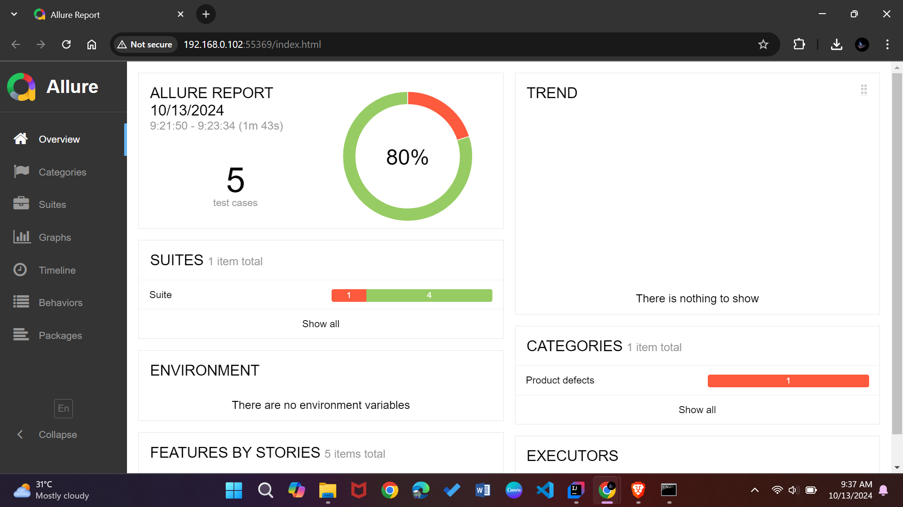
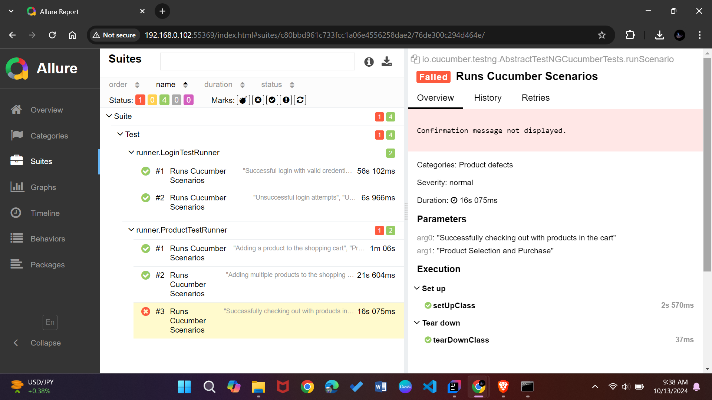

# Selenium TestNG Cucumber Project

## Overview
This project uses Cucumber, Selenium, and TestNG, focusing on Behavior-Driven Development (BDD) and the Page Object Model (POM). Cucumber allows for plain language specifications, promoting collaboration, while POM enhances code organization. TestNG facilitates streamlined test execution and reporting, creating an efficient testing framework.

## Supports
- Page Object Model
- Page Context (DI)
- Headless Run
- Data-Driven Testing (DDT)
- Tagging Tests
- Failed Screenshot
- Chaining Methods
- Parallel Test
- Allure Report


## Setups
- Install **Selenium WebDriver**.   
- Configure **TestNG** in `testng.xml`.
- Write feature files in **Cucumber**.
- Implement **Page Object Model (POM)**.
- Use **Hooks** for setup and teardown.

## Prerequisites
- Java JDK 8 or higher
- Maven
- IDE (IntelliJ IDEA, Eclipse)
- WebDriver (e.g., ChromeDriver)

## Page Object Model
The Page Object Model (POM) is implemented to create an object repository for web UI elements. Each page of the application is represented by a class, which contains methods that correspond to the actions that can be performed on that page.

For example, a login page class might look like this:
```java
public class LoginPage {
    private WebDriver driver;

    @FindBy(id = "username") private WebElement usernameField;
    @FindBy(id = "password") private WebElement passwordField;
    @FindBy(id = "loginButton") private WebElement loginButton;

    public LoginPage(WebDriver driver) {
        this.driver = driver;
        PageFactory.initElements(driver, this);
    }

    public LoginPage enterCredentials(String username, String password) {
        usernameField.sendKeys(username);
        passwordField.sendKeys(password);
        return this;
    }

    public HomePage clickLogin() {
        loginButton.click();
        return new HomePage(driver);
    }
}

// Usage
new LoginPage(driver)
    .enterCredentials("user1", "pass1")
    .clickLogin();
```
In this example, methods return the current instance, allowing for a smooth sequence of actions. POM enhances clarity and maintainability, making it easier to adapt to UI changes.

## Tagging Tests
Cucumber allows for tagging tests to organize and run specific scenarios. Tags can be added in feature files and can be executed with the command line using:
```
cucumber --tags @tagName
```

## Headless Run
The headless mode is enabled by default for Chrome, Firefox, and Edge. You can control this via Maven properties.

To run the tests in headless mode, use the following Maven command:
```bash
mvn clean test -Dbrowser=chrome -Dheadless=true
```
- `Dbrowser=chrome`: Use Chrome as the browser (you can replace it with `firefox` or `edge`).
- `Dheadless=true`: Enables headless mode.

### Hooks.java
```java
// Inside Hooks.java
ChromeOptions options = new ChromeOptions();
if (headless) {
        options.addArguments("--headless", "--disable-gpu", "--window-size=1920,1080");
// Add additional configurations as needed
}
```

### BrowserDriverFactory.java
```java
// Inside BrowserDriverFactory.java
if (headless) {
        chromeOptions.addArguments("--headless");
    firefoxOptions.addArguments("--headless");
    edgeOptions.addArguments("--headless");
}
```
### Explanation:
- **Hooks.java**: The headless option is added for Chrome in the `Hooks` class if the `headless` flag is true. Additional options can be added as required.
- **BrowserDriverFactory.java**: Similar configuration is applied for Chrome, Firefox, and Edge browsers in `BrowserDriverFactory` for cross-browser headless testing.

This ensures the tests run in headless mode across different browsers, providing a faster and more efficient execution in CI/CD pipelines.


## Allure Report
Allure framework is integrated for generating detailed reports. To view reports, follow these steps:

1. Ensure Allure dependencies are included in your `pom.xml`.
2. Run tests with the Allure listener.
3. Generate the report with:
```
mvn allure:report
mvn allure:serve
```
## Failed Screenshot

Capture screenshots on test failure and attach them to Cucumber and Allure reports.

### Code to Capture Screenshot on Failure

```
public void afterScenario(Scenario scenario) {
    if (scenario.isFailed()) {
        byte[] screenshot = takeScreenshot();
        scenario.attach(screenshot, "image/png", "Screenshot on Failure"); // Attach to Cucumber
        saveScreenshotToAllure(screenshot); // Attach to Allure
    }
    context.getDriver().quit();
}

private byte[] takeScreenshot() {
    return context.getDriver().getScreenshotAs(OutputType.BYTES);
}

@io.qameta.allure.Attachment(value = "Screenshot on Failure", type = "image/png")
private byte[] saveScreenshotToAllure(byte[] screenshot) {
    return screenshot; // Attach to Allure
}
```
## Chaining method
Method chaining is a programming technique where multiple method calls are made in a single statement. This is particularly useful in POM as it can lead to more readable and concise code. In this project, methods in page classes can return `this`, allowing for easy chaining of actions.

For instance, in a login page class, methods can be designed to return the current instance of the class, allowing the next method to be called directly on the same object:
```java
public class LoginPage {
    public LoginPage enterUsername(String username) {
        usernameField.sendKeys(username);
        return this;
    }

    public LoginPage enterPassword(String password) {
        passwordField.sendKeys(password);
        return this;
    }

    public HomePage clickLogin() {
        loginButton.click();
        return new HomePage();
    }
}
```
Using chaining in your test code makes it more fluent and easier to understand:
```java
LoginPage loginPage = new LoginPage(driver);
loginPage.enterUsername("user1")
          .enterPassword("pass1")
          .clickLogin();
```
This technique enhances code readability and reduces boilerplate code, making it easier to write and maintain tests.

## Running Tests in Parallel with TestNG
TestNG supports parallel test execution, making your tests run faster. You can set this up in the testng.xml file by specifying how you want the tests to run.
Example: `testng.xml`
```
<?xml version="1.0" encoding="UTF-8"?>
<suite name="Tests" parallel="classes" thread-count="3">
    <test name="ChromeTests">
        <parameter name="browser" value="chrome"/>
        <parameter name="headless" value="true"/>
        <classes>
            <class name="runner.LoginTestRunner" />
            <class name="runner.ProductTestRunner" />
        </classes>
    </test>

    <test name="FirefoxTests">
        <parameter name="browser" value="firefox"/>
        <parameter name="headless" value="true"/>
        <classes>
            <class name="runner.LoginTestRunner" />
            <class name="runner.ProductTestRunner" />
        </classes>
    </test>

    <test name="EdgeTests">
        <parameter name="browser" value="edge"/>
        <parameter name="headless" value="true"/>
        <classes>
            <class name="runner.LoginTestRunner" />
            <class name="runner.ProductTestRunner" />
        </classes>
    </test>
</suite>
```
In this configuration:

- `parallel="methods"` enables parallel execution of test methods within classes.
- `thread-count="3"` specifies that up to 3 threads can run simultaneously.
This setup allows for multiple tests to be executed concurrently, improving overall test execution time while maintaining test isolation.
### Clone the Repository
```bash
git clone https://github.com/username/repository.git
cd repository
```

## Installation
1. Navigate to the project directory.

2. Install project dependencies using Maven:
```bash
mvn clean install
```
3. Configure any required environment variables or settings in your `config.properties` file.

## Allure Report
#### Maven Configuration for Allure
To generate Allure reports after test execution, add the following plugin to your `pom.xml` file.
```
<plugins>
    <!-- Allure Maven Plugin -->
    <plugin>
        <groupId>io.qameta.allure</groupId>
        <artifactId>allure-maven</artifactId>
        <version>2.15.2</version>
        <executions>
            <execution>
                <goals>
                    <goal>aggregate</goal>
                </goals>
            </execution>
        </executions>
    </plugin>
</plugins>
```
Note: The correct goal to use for generating and aggregating Allure reports is `aggregate`, not `generate` or `serve`.
###     Generating and Serving the Report
After running tests, you can generate and view Allure reports to analyze results and failures. To generate the report:

1. Run your tests using:
```bash
mvn test
```
2. Generate the Allure report:
```bash
mvn allure:report
```
3. Serve the report:
```bash
mvn allure:serve
```
### Example Screenshots



The reports will provide insights into passed, failed, and skipped tests along with detailed information on each test case.